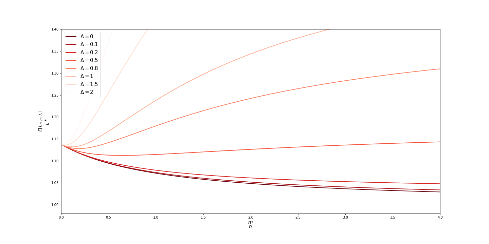
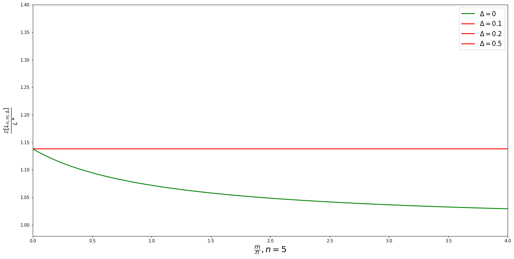

# 1. 1-D Fisher's Linear Discriminant (FLD)

Consider an in-distribution task and an out-of-distribution task specified by the distributions $F_{in}$ and $F_{out}$, respectively. $F_{in}$ is characterized by the class conditional densities, 
     \begin{equation}
     f_{0, in} = \mathcal{N}(-\mu, \sigma^2) 
     \end{equation}
     \begin{equation}
     f_{1, in} = \mathcal{N}(\mu, \sigma^2) 
     \end{equation}
and $F_{out}$ is characterized by the class conditional densities,
    \begin{equation} 
     f_{0, out} = \mathcal{N}(-\mu + \Delta, \sigma^2) 
    \end{equation}
    \begin{equation}
     f_{1, out} = \mathcal{N}(\mu + \Delta, \sigma^2) 
    \end{equation}

Suppose that we have $n$ samples $S_{in} = \{X_i, Y_i\}_{i=1}^n$ drawn from $F_{in}$ and $m$ samples $S_{out} = \{X_j, Y_j\}_{j=1}^m$ drawn from $F_{out}$. The samples are class-balanced. We are interested in generalizing on the in-distribution task using both $S_{in}$ and $S_{out}$.

## 1.1 Single-Head FLD

Let $M_0$ and $M_1$ be the estimated means of classes 0 and 1 respectively. Note that each class comprises of samples from both in- and out-of-distribution tasks. Consider $M_0$, which is given by, 

\begin{equation}
    M_0 = \frac{\sum_{i=1}^{n/2} X_i + \sum_{j=1}^{m/2} X_j}{n/2 + m/2}
\end{equation}

The mean and variance of $M_0$ are given by, 

\begin{equation}
    \mathbb{E}[M_0] = -\mu + \frac{m}{n+m} \Delta
\end{equation}

\begin{equation}
    \text{Var}[M_0] = \frac{2\sigma^2}{n+m}
\end{equation}

By the central limit theorem, it can be shown that

\begin{equation}
    M_0 \sim \mathcal{N}\bigg( -\mu + \frac{m}{n+m} \Delta, \frac{2\sigma^2}{n+m} \bigg)
\end{equation}

Similarly,

\begin{equation}
    M_1 \sim \mathcal{N}\bigg( \mu + \frac{m}{n+m} \Delta, \frac{2\sigma^2}{n+m} \bigg)
\end{equation}

It can be noted that a sample $X$ in the combined class 0 is drawn from a Gaussian mixture distribution given by, 

\begin{equation}
    X \sim f_0 = \frac{n}{n+m} f_{0, in} + \frac{m}{n+m} f_{0, out}
\end{equation}

Therefore, 
\begin{equation}
 \mathbb{E}[X] = \int_{\mathbb{R}} x \frac{n}{n+m} f_{0, in}(x) dx + \int_{\mathbb{R}} x \frac{m}{n+m} f_{0, out}(x) dx = -\mu + \frac{m}{n+m} \Delta 
\end{equation}
\begin{equation}
 \mathbb{E}[X^2] = \int_{\mathbb{R}} x^2 \frac{n}{n+m} f_{0, in}(x) dx + \int_{\mathbb{R}} x^2 \frac{m}{n+m} f_{0, out}(x) dx = \frac{n}{n+m}(\sigma^2 + \mu^2) + \frac{m}{n+m}(\sigma^2 + (-\mu+\Delta)^2)  
\end{equation}

Hence, the variance of class 0 samples is given by, 

\begin{equation}
   \text{Var}[X] = \sigma^2 + \frac{mn}{(n+m)^2} \Delta^2
\end{equation}

It can be shown that class 1 samples have the same variance. Therefore, the variances $\Sigma_0$ and $\Sigma_1$ of class 0 and 1 are given by, 

\begin{equation}
   \Sigma_0 = \Sigma_1 = \Sigma = \sigma^2 + \frac{mn}{(n+m)^2} \Delta^2
\end{equation}

**Lemma 1.1.1** The generalization risk of the in-distribution task is non-monotonic w.r.t to OOD sample size $m$, under certain shifts $\Delta$.

*Proof.* The decision rule of the single-head FLD is given by, 

\begin{equation}
g(x) = 
\begin{cases}
   1, & \omega^\top x > c \\
   0, & \text{otherwise}
\end{cases}
\end{equation}

where, $\omega = (\Sigma_0 + \Sigma_1)^{-1} (M_1 - M_0)$ and $c = \omega^\top \frac{1}{2}(M_0 + M_1)$. In the single-head FLD, both in-distribution and OOD samples are used to estimate the projection vector $\omega$ and threshold $c$.

Consider the expression $\omega^\top x > c$. 

\begin{align}
   \omega^\top x &> c \\
   (\Sigma_0 + \Sigma_1)^{-1} (M_1 - M_0) &> (\Sigma_0 + \Sigma_1)^{-1} (M_1 - M_0) \frac{1}{2}(M_0 + M_1) \\
   \frac{M_1 - M_0}{2\big( \sigma^2 + \frac{mn}{(n+m)^2} \Delta^2 \big)}x &> \frac{M_1 - M_0}{2\big( \sigma^2 + \frac{mn}{(n+m)^2} \Delta^2 \big)} \frac{1}{2}(M_0 + M_1) \\
    x &> \frac{1}{2}(M_0 + M_1)
\end{align}

Therefore, Eq. (9) reduces to the following decision rule.

\begin{equation}
g(x) = 
\begin{cases}
   1, & x > h \\
   0, & \text{otherwise}
\end{cases}
\end{equation}

where, $h = \frac{1}{2}(M_0 + M_1)$.

Now, consider a test input $X$ from the in-distribution task, i.e. $X \sim F_{in}$. The generalization risk $L(h)$ is then given by,

\begin{align}
    L(h) &= P[Y \neq g(X)| X=x] \\
    &= P[Y=1, g(X)=0| X=x] + P[Y=0, g(X)=1| X=x] \\
    &= P[Y=1, X < h| X=x] + P[Y=0, X > h| X=x] \\
    &= P[X < h| Y=1, X=x]P[Y=1| X=x] + P[X > h| Y=0,X=x]P[Y=0| X=x]\\
    &= \frac{1}{2} P[X < h| Y=1, X=x] + \frac{1}{2} P[X > h| Y=0,X=x]\\
    &= \frac{1}{2} \big( P_{X \sim f_1}[X < h] + P_{X \sim f_0}[X > h] \big)\\
    &= \frac{1}{2} \big( P_{X \sim f_{1,in}}[X < h] + 1 - P_{X \sim f_{0, in}}[X < h] \big)\\
    &= \frac{1}{2} \bigg[ 1 - \Phi\bigg(\frac{h+\mu}{\sigma}\bigg) + \Phi \bigg( \frac{h-\mu}{\sigma} \bigg) \bigg]
\end{align}

Therefore,

\begin{equation}
   L(h) = \frac{1}{2} \bigg[ 1 - \Phi\bigg(\frac{h+\mu}{\sigma}\bigg) + \Phi \bigg( \frac{h-\mu}{\sigma} \bigg) \bigg]
\end{equation}

where, $h = \frac{1}{2}(M_0 + M_1) \sim \phi = \mathcal{N}\big( \frac{m}{n+m}\Delta, \frac{\sigma^2}{n+m} \big)$. 

The expected generalization risk is given by, 

\begin{align}
   L_{n, m, \Delta} &= \mathbb{E}[L(h)] \\
   L_{n, m, \Delta} &= \int_{-\infty}^{\infty} L(h) \phi(h) dh
\end{align}

Fig. 1.1 illustrates the non-monotonic nature of the expected generalization error w.r.t OOD sample size.

*Figure 1.1.1 OOD sample size vs. expected generalization risk for single-head FLD under various shifts $\Delta$. ($n=5, \mu=1, \sigma=1$)*

## 1.2 Multi-Head FLD

In the multi-head setting, the projection vector $\omega$ is estimated using both the in-distribution and OOD samples. However, now there would be 2 thresholds $c_{in}$ and $c_{out}$ reflecting the two task-specific heads of the FLD. The projection vector estimated using both the in-distribution and OOD samples is given by,

\begin{equation}
   \omega = (\Sigma_0 + \Sigma_1)^{-1} (M_1 - M_0) =  \frac{M_1 - M_0}{2\big( \sigma^2 + \frac{mn}{(n+m)^2} \Delta^2 \big)}
\end{equation}

Next, consider $c_{in}$, the threshold specific to the in-distribution task.

\begin{equation}
   c_{in} = \omega^\top \frac{1}{2}(M_{0, in} + M_{1, in})
\end{equation}

where, $M_{0, in} = \frac{1}{n/2} \sum_{i=1}^{n/2} X_i$ and $M_{1, in} = \frac{1}{n/2} \sum_{i=n/2+1}^{n} X_i$. By central limit theorem, $M_{0, in} \sim \mathcal{N}(-\mu, 2\sigma^2/n)$ and  $M_{1, in} \sim \mathcal{N}(\mu, 2\sigma^2/n)$. 

**Lemma 1.2.1** The generalization risk of the in-distribution task is monotonic w.r.t to OOD sample size $m$.

*Proof*. The decision rule of the multi-head FLD specific to in-distribution task is given by,

\begin{equation}
g_{in}(x) = 
\begin{cases}
   1, & \omega^\top x > c_{in} \\
   0, & \text{otherwise}
\end{cases}
\end{equation}

where, $\omega = (\Sigma_0 + \Sigma_1)^{-1} (M_1 - M_0)$ and $c_{in} = \omega^\top \frac{1}{2}(M_{0, in} + M_{1, in})$. In the multi-head FLD, both in-distribution and OOD samples are used to estimate the projection vector $\omega$ and the threshold $c_{in}$ is estimated only using the projected in-distribution data.

Consider the expression $\omega^\top x > c_{in}$. 
\begin{align}
   \omega^\top x &> c_{in} \\
   (\Sigma_0 + \Sigma_1)^{-1} (M_1 - M_0) &> (\Sigma_0 + \Sigma_1)^{-1} (M_1 - M_0) \frac{1}{2}(M_{0, in} + M_{1, in}) \\
   \frac{M_1 - M_0}{2\big( \sigma^2 + \frac{mn}{(n+m)^2} \Delta^2 \big)}x &> \frac{M_1 - M_0}{2\big( \sigma^2 + \frac{mn}{(n+m)^2} \Delta^2 \big)} \frac{1}{2}(M_{0, in} + M_{1, in}) \\
    x &> \frac{1}{2}(M_{0, in} + M_{1, in})
\end{align}

Therefore, the decision rule reduces to, 
\begin{equation}
g_{in}(x) = 
\begin{cases}
   1, & x > h_{in} \\
   0, & \text{otherwise}
\end{cases}
\end{equation}
where, $h_{in} = \frac{1}{2}(M_{0, in} + M_{1, in})$.

As in the proof of Lemma 1.1.1, it can be shown that the generalization error $L(h)$ of the in-distribution task is given by, 

\begin{equation}
   L(h) = \frac{1}{2} \bigg[ 1 - \Phi\bigg(\frac{h_{in}+\mu}{\sigma}\bigg) + \Phi \bigg( \frac{h_{in}-\mu}{\sigma} \bigg) \bigg]
\end{equation}

where, $h_{in} = \frac{1}{2}(M_{0, in} + M_{1, in}) \sim \phi = \mathcal{N}(0, \sigma^2/n)$. A special cases arises when $\Delta = 0$ where $h_{in} = \frac{1}{2}(M_{0, in} + M_{1, in}) \sim \phi = \mathcal{N}(0, \sigma^2/(n+m))$

The expected generalization risk is given by, 

\begin{align}
   L_{n, m, \Delta} &= \mathbb{E}[L(h)] \\
   L_{n, m, \Delta} &= \int_{-\infty}^{\infty} L(h) \phi(h) dh
\end{align}

*Figure 1.2.1 OOD sample size vs. expected generalization risk for multi-head FLD under various shifts $\Delta$. ($n=5, \mu=1, \sigma=1$)*

