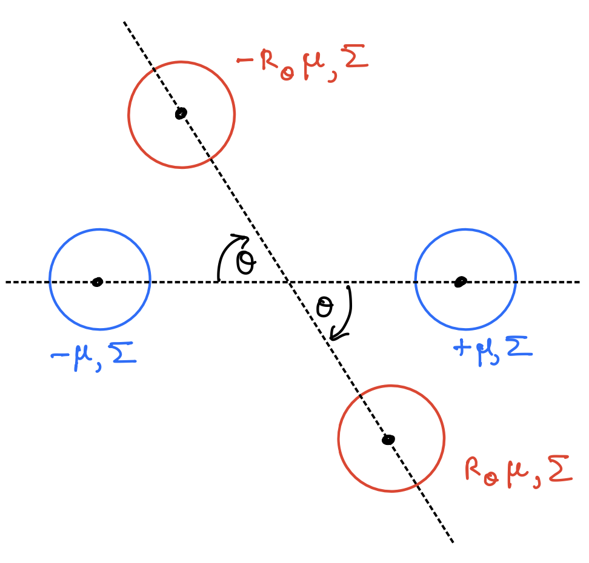

# 1. N-D Fisher's Linear Discriminant (FLD)

{ width=50% }

Consider an in-distribution task and an out-of-distribution task specified by the distributions $F_{in}$ and $F_{out}$, respectively. $F_{in}$ is characterized by the class conditional densities, 
     \begin{equation}
     f_{0, in} = \mathcal{N}(-\mu, \Sigma) 
     \end{equation}
     \begin{equation}
     f_{1, in} = \mathcal{N}(\mu, \Sigma) 
     \end{equation}
and $F_{out}$ is characterized by the class conditional densities,
    \begin{equation} 
     f_{0, out} = \mathcal{N}(-R_{\theta}\mu, \Sigma) 
    \end{equation}
    \begin{equation}
     f_{1, out} = \mathcal{N}(R_{\theta} \mu, \Sigma) 
    \end{equation}

where,
\begin{equation}
    R_{\theta} = 
    \begin{bmatrix}
        \cos \theta & \sin \theta\\
        -\sin \theta & \cos \theta
\end{bmatrix}
\end{equation}

Suppose that we have $n$ samples $S_{in} = \{X_i, Y_i\}_{i=1}^n$ drawn from $F_{in}$ and $m$ samples $S_{out} = \{X_j, Y_j\}_{j=1}^m$ drawn from $F_{out}$. The samples are class-balanced. We are interested in generalizing on the in-distribution task using both $S_{in}$ and $S_{out}$.

Let $M_0$ and $M_1$ be the estimated means of classes 0 and 1 respectively. Note that each class comprises of samples from both in- and out-of-distribution tasks. Consider $M_1$, which is given by, 

\begin{equation}
    M_1 = \frac{\sum_{i=1}^{n/2} X_i + \sum_{j=1}^{m/2} X_j}{n/2 + m/2}
\end{equation}

The mean and variance of $M_1$ are given by, 

\begin{equation}
    \mathbb{E}[M_1] = \frac{(nI + mR_{\theta})\mu}{n+m}
\end{equation}

\begin{equation}
    \text{Var}[M_1] = \frac{2}{n+m}\Sigma
\end{equation}

By the central limit theorem,

\begin{equation}
    M_1 \sim \mathcal{N}\bigg( \frac{(nI + mR_{\theta})\mu}{n+m}, \frac{2}{n+m}\Sigma \bigg)
\end{equation}

Similary, for $M_0$, 

\begin{equation}
    M_0 \sim \mathcal{N}\bigg( -\frac{(nI + mR_{\theta})\mu}{n+m}, \frac{2}{n+m}\Sigma \bigg)
\end{equation}

The decision rule of the FLD is given by, 

\begin{equation}
g(x) = 
\begin{cases}
   1, & \omega^\top x > c \\
   0, & \text{otherwise}
\end{cases}
\end{equation}

where, $\omega = (\Sigma_0 + \Sigma_1)^{-1}(M_1 - M_0)$ and $c = \omega^\top (M_1 + M_0)/2$. ($\Sigma_1$ and $\Sigma_1$ are the variances of class 0 and 1 respectively). By letting, $h = (M_1 + M_0)/2$, the decision rule can be written as, 

\begin{equation}
g(x) = 
\begin{cases}
   1, & \omega^\top x > \omega^\top h \\
   0, & \text{otherwise}
\end{cases}
\end{equation}

Now, consider a test input $X$ from the in-distribution task, i.e. $X \sim F_{in}$. The generalization risk $L(w, h)$ is then given by,

\begin{align}
    L(w, h) &= P[Y \neq g(X)| X=x] \\
    &= \frac{1}{2} \big( P_{X \sim f_{1,in}}[\omega^\top X < \omega^\top h] + P_{X \sim f_{0,in}}[\omega^\top X > \omega^\top h] \big)\\
    &= \frac{1}{2} \big( 1 + P_{X \sim f_{1,in}}[\omega^\top X < \omega^\top h] - P_{X \sim f_{0,in}}[\omega^\top X < \omega^\top h] \big)
\end{align}

