

# Out-of-Distribution Learning

___

## Gaussian Tasks Experiment

- Consider an in-distribution task that consists of two class conditional gaussians. 
- Now, consider an out-of-distribution task similar to the above task, but whose center is displaced by an amount $\Delta$.
- The amount $\Delta$ reflects the "similarity" between the two tasks.

___

## Gaussian Tasks Experiment

- We have access to $n$ samples from the in-distribution task, and $m$ samples from the out-of-distribution task.
- Using both the in-distribution and out-of-distribution samples, we train a classifier $h$ aimed at the in-distribution classification task.
- Let's denote the classification error of $h$ by $\mathbb{E}[L_{n, m, \Delta}]$.

___

## Gaussian Tasks Experiment

- Let $n$ be a small fixed constant. We hypothesize that, 
    - For very small $\Delta$, as we add more out-of-distribution data (as $m$ increases) the $\mathbb{E}[L_{n, m, \Delta}]$ would decrease. 
    - For moderately large $\Delta$, as we add more out-of-distribution data (as $m$ increases) the $\mathbb{E}[L_{n, m, \Delta}]$ would initially decrease and start increasing later. The initial decrease is due to the reduction in the variance of $h$. The later increase is due to the increase in bias of $h$ caused by the out-of-distribution samples. 
    - For very large $\Delta$, as we add more out-of-distribution data (as $m$ increases) the $\mathbb{E}[L_{n, m, \Delta}]$ would keep increasing.

___

## Gaussian Tasks Experiment

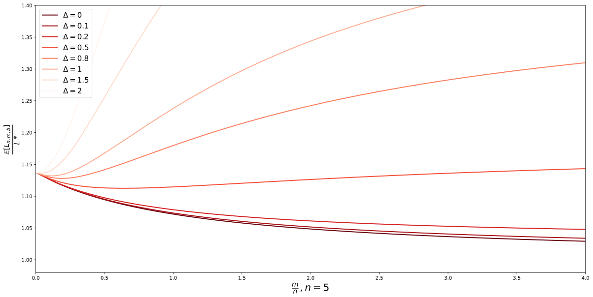

___

## Gaussian Tasks Experiment

- Number of replicates: 1000

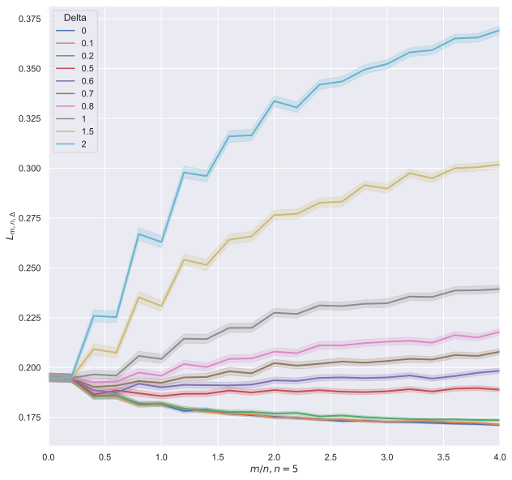

___

## Gaussian Tasks Experiment

- Number of replicates: 1000

___

## Bird vs. Cat & $\alpha$-Rotated Bird vs. Cat (Single-Head Network)

- Number of replicates: 10, Network: SmallConv

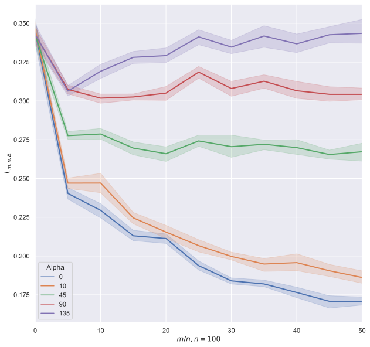

---

## Bird vs. Cat & $\alpha$-Rotated Bird vs. Cat (Single-Head Network)

- Number of replicates: 10, Network: SmallConv

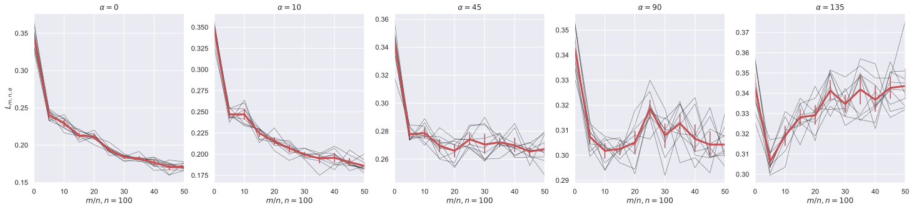

___

## Task 2: Bird vs. Cat & Task 3: Deer vs. Dog (Single-Head Network)

- Number of replicates: 20, Network: SmallConv

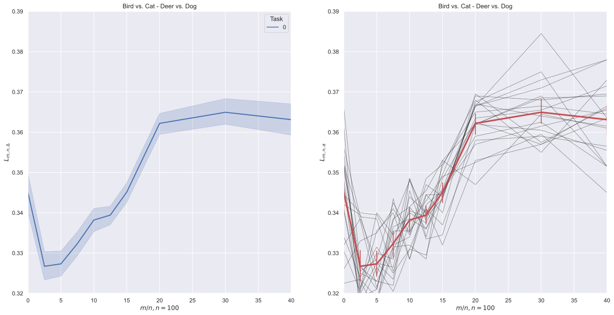

___

## Task 2: Bird vs. Cat & Task 3: Deer vs. Dog (Single-Head Network)

- Number of replicates: 20, Network: SmallConv, each model was trained for 100 epochs

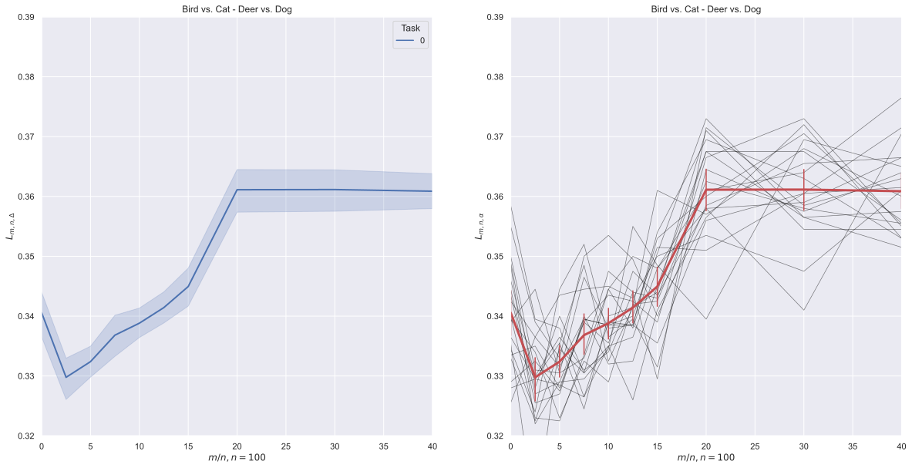

___

## Task 2: Bird vs. Cat & Task 3: Deer vs. Dog (Multi-Head Network)

- Number of replicates: 20, Network: SmallConv

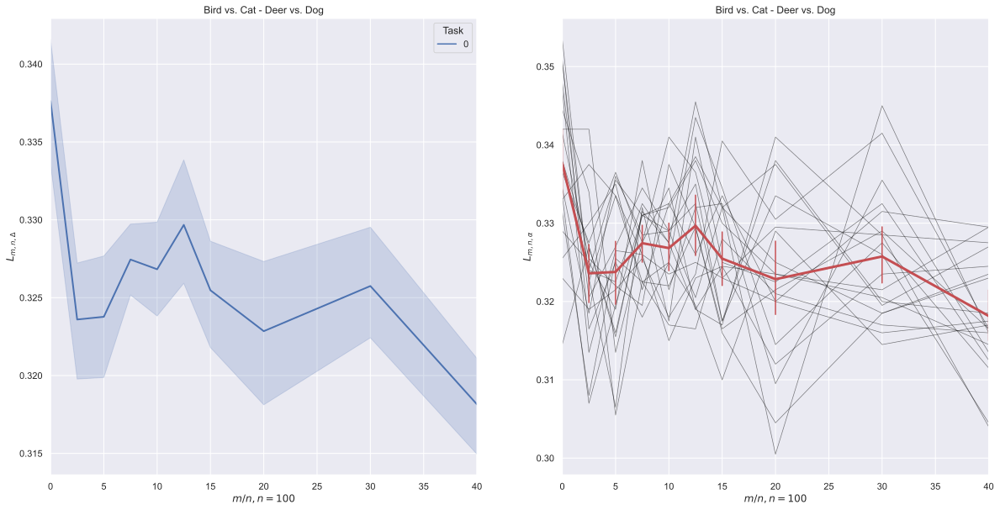

___

## Task 2: Bird vs. Cat & Task 4: Frog vs. Horse (Multi-Head Network)

- Number of replicates: 20, Network: SmallConv

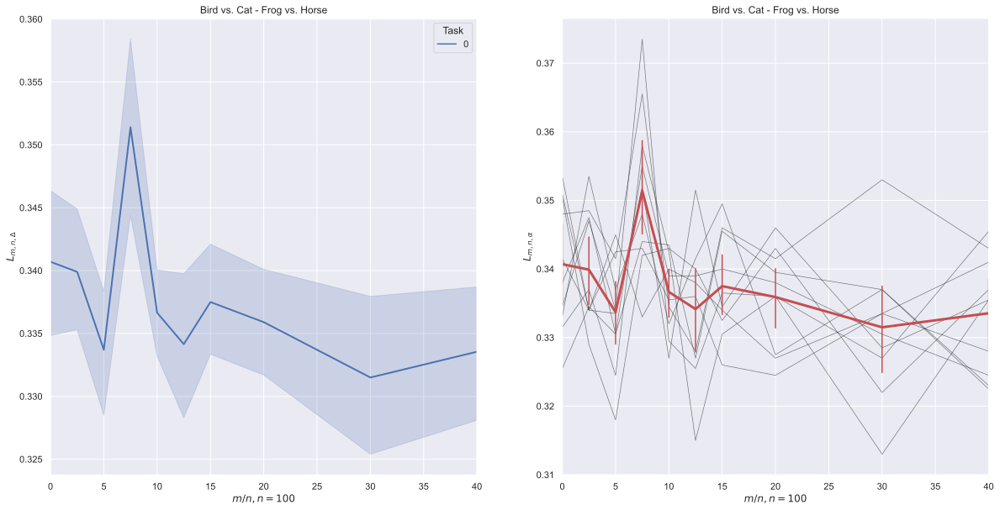

___

## Task 2: Bird vs. Cat & Task 3: Deer vs. Dog (Multi-Head Network)

- Number of replicates: 10, Network: Wide Res-Net

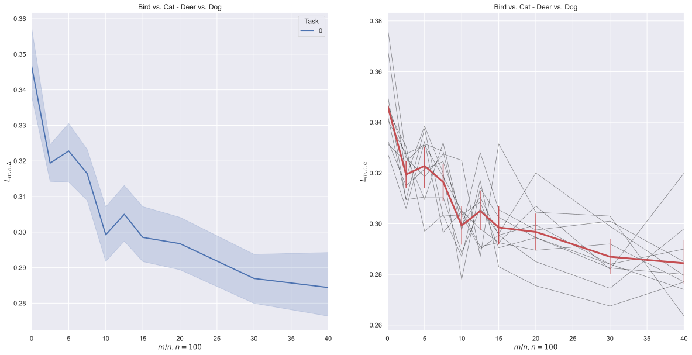
___

## Task 2: Bird vs. Cat & Task 4: Frog vs. Horse (Multi-Head Network)

- Number of replicates: 10, Network: Wide Res-Net

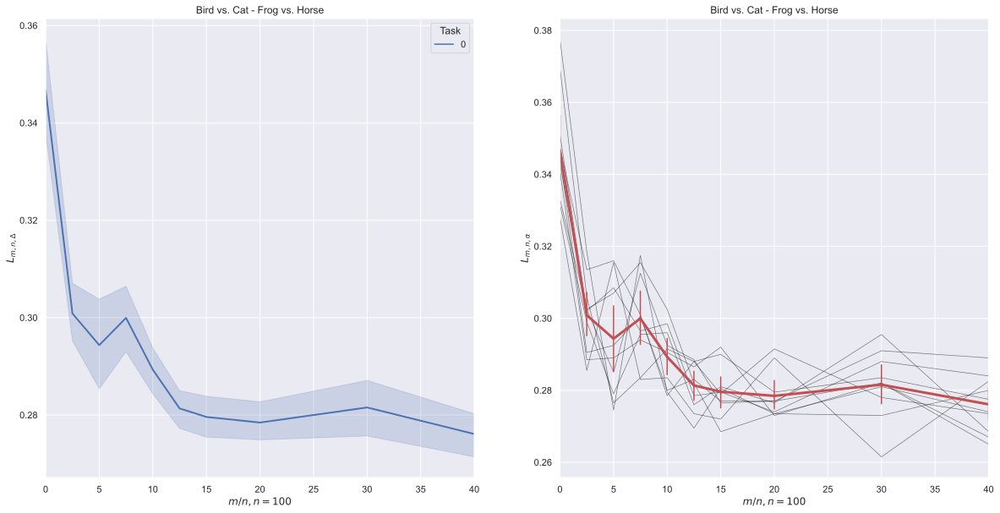

___

## Task 4: Frog vs. Horse & Task 2: Bird vs. Cat (Multi-Head Network)

- Number of replicates: 10, Network: Wide Res-Net

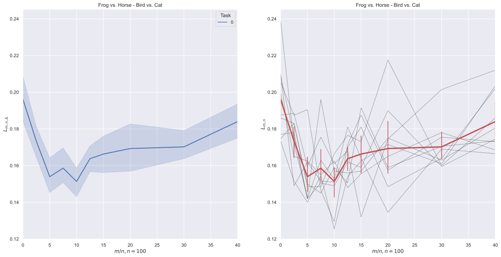

___

## Bivariate LDA Problem

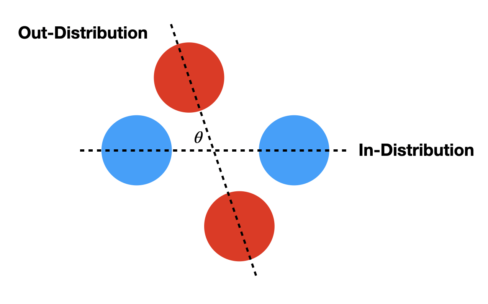

___

## Bivariate LDA Problem

- $X | Y = -1 \sim \mathcal{N}(-\mu_0, \Sigma)$ and $X | Y = +1 \sim \mathcal{N}(\mu_0, \Sigma)$ consititute the in-distribution where $\mu_0 = [\mu, 0]^\top$
- $X | Y = -1 \sim \mathcal{N}(-\mu_{\theta}, \Sigma)$ and $X | Y = +1 \sim \mathcal{N}(\mu_{\theta}, \Sigma)$ consititute the out-of-distribution where $\mu_{\theta} = [\mu \cos \theta, - \mu \sin \theta]^\top$
- Then, the estimated class means $\hat{\mu}_{-1}$ and $\hat{\mu}_{+1}$ are given by, 
    $$ \hat{\mu}_{-1} \sim \mathcal{N}\bigg( \bigg[ \frac{-\mu( n + m \cos \theta)}{n+m}, \frac{\mu m \sin \theta }{n+m} \bigg]^\top, \frac{1}{n+m} \Sigma \bigg) $$
    $$ \hat{\mu}_{+1}= - \hat{\mu}_{-1} \sim \mathcal{N}\bigg( \bigg[ \frac{\mu( n + m \cos \theta)}{n+m}, -\frac{\mu m \sin \theta }{n+m} \bigg]^\top, \frac{1}{n+m} \Sigma \bigg) $$

___

## Bivariate LDA Problem

- The LDA's classification rule is given by, 
    $$ g(x) = \text{sign} ( w \cdot x > c) $$ 
    where, 
$$ w = \Sigma^{-1} (\hat{\mu}_{+1} - \hat{\mu}_{-1}) = 2 \Sigma^{-1} \hat{\mu}_{+1} $$
$$ c = \frac{1}{2}(\hat{\mu}_{+1} + \hat{\mu}_{-1}) = 0 $$
- Therefore,  
    $$ g(x) = \text{sign} ( \hat{\mu}_{+1} \cdot x > 0) $$ 
___

## Bivariate LDA Problem

- If $\mu = 1$ and $\Sigma = I$,
    $$ \hat{\mu}_{+1} \sim \mathcal{N}\bigg( \bigg[ \frac{( n + m \cos \theta)}{n+m}, -\frac{m \sin \theta }{n+m} \bigg]^\top, \frac{1}{n+m} I \bigg) $$
    $$ x | y = -1 \sim f_{-1} = \mathcal{N}\big( [-1, 0]^\top, \Sigma) \big) $$
    $$ x | y = +1 \sim f_{+1} = \mathcal{N}\big( [1, 0]^\top, \Sigma) \big) $$
- Hence, the error $L(\hat{\mu}_{+1})$ is given by, 
    $$ L(\hat{\mu}_{+1}) = \mathbb{P}_{x \sim f_{-1}}[ \hat{\mu}_{+1} \cdot x > 0 ] + \mathbb{P}_{x \sim f_{+1}}[ \hat{\mu}_{+1} \cdot x < 0 ] $$ 
- Therefore, 
    $$ \mathbb{E}[L_{m, n, \theta}] = \mathbb{E}_{\hat{\mu}_{+1}}[L(\hat{\mu}_{+1})] $$

    